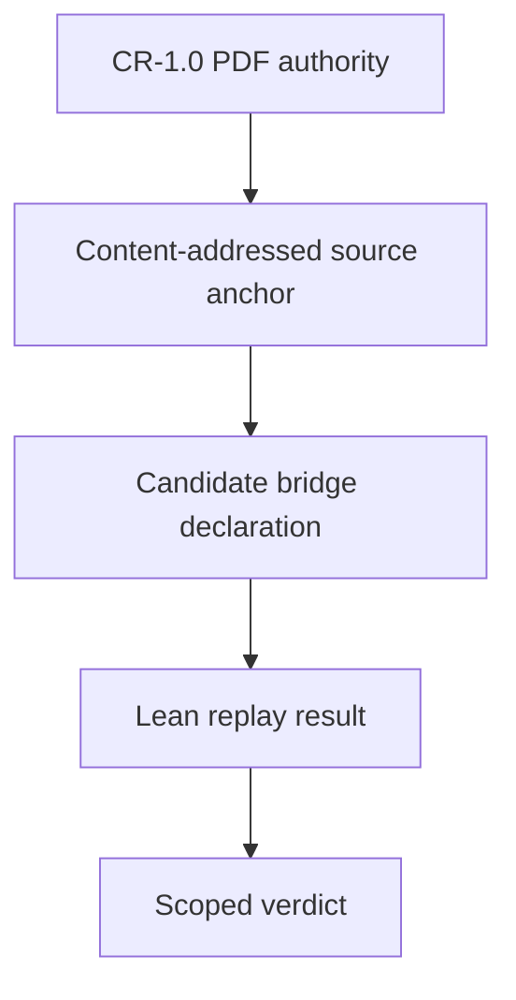

# DF-10 / TH-3 bridge pilot

This pilot turns one definition and one theorem into a testable vertical slice without claiming that the whole CR-1.0 calculus has been formalized.

| Stage | Artifact | Result |
|---|---|---|
| S0 — source identity | PDF digest, page geometry, clause boxes, literal word snapshots, reviewed readings | Replayed against the supplied PDF |
| S1 — typed candidate | `CRModel`, `IntervalContext`, `EIB_DF10_CANDIDATE` | Every binder is explicit; endpoint existence is local, not globally assumed |
| S2 — positive direction | `EIB_TH3a_unfold` | Exact definitional unfolding; empty axiom list |
| S3 — non-sufficiency | finite distinct-sort model with `CCPResult = True`, `Retained = True`, `K_E = False` | Uniform sufficiency refuted for the pilot signature; empty axiom list |

The bridge is the separation between immutable evidence and mutable interpretation:

The final verdict is deliberately scoped. The source theorem declares dependencies on `MS-4`, `MS-8`, `SC-7`, `SC-8`, `DF-7a`, `DF-10`, `IR-2`, and `IR-4`. Until those mappings are accepted, the repository may say that the pilot proof replayed, but it may not say that authoritative TH-3 was proved.

## Why this bridge is fail-closed

An anchor edit changes its digest and breaks old declaration references. A proposed status cannot overwrite source status. Duplicate JSON keys, floats, hidden binders, path traversal, stale locators, contradictory evidence, and absent `K_E` evidence are rejected or blocked. The PDF is hashed before a parser sees it, and the parser receives a private copy of those exact verified bytes.
