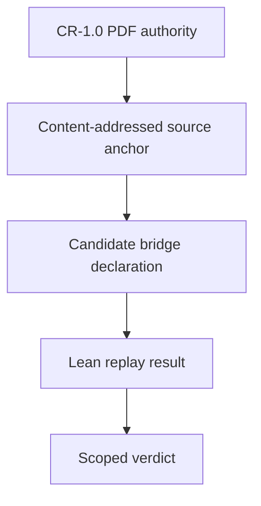

# DF-10 / TH-3 bridge pilot

This pilot turns one definition and one theorem into a testable vertical slice without claiming that the whole CR-1.0 calculus has been formalized.

| Stage | Artifact | Result |
|---|---|---|
| S0a — machine source replay | PDF digest, page geometry, clause boxes, literal word snapshots | Replayed against the supplied PDF |
| S0b — reviewed transcription | Reviewed readings and declared transformations | Hash-pinned and human-reviewed; transformation fidelity is not machine-checked |
| S1 — legacy typed candidate | `CRModel`, `IntervalContext`, `EIB_DF10_CANDIDATE` | Preserved as the original unconstrained pilot rather than silently migrated |
| S1.1 — role refinement | `ContentRoleRefinement`, `ProblemContent`, `EndTimeWitness`, `EIB_DF10_REFINED` | Shared Content identity and potentially overlapping bridge role sorts that are not required disjoint; endpoint existence remains local |
| S1.2 — projection and definition audit | `EIB_DF10_refined_projection`, `EIB_DF10_canonical_model_expansion_exists` | Selected `(I, t_I)` is preserved; every fixed refined port base has an EKC expansion with unchanged reduct |
| S2 — positive direction | `EIB_TH3a_unfold` | Exact definitional unfolding of the legacy DF-10 candidate; empty axiom list |
| S3 — non-sufficiency | finite distinct-sort model with `CCPResult = True`, `Retained = True`, `K_E = False` | Uniform sufficiency refuted for the legacy pilot signature; empty axiom list |

The bridge is the separation between immutable evidence and mutable interpretation:

The final verdict is deliberately scoped. The source theorem declares
dependencies on `MS-4`, `MS-8`, `SC-7`, `SC-8`, `DF-7a`, `DF-10`, `IR-2`, and
`IR-4`. Until those mappings are accepted, the repository may say that the
pilot proof replayed, but it may not say that authoritative TH-3 was proved.
The two TH-3 declaration records depend specifically on the preserved legacy
identity `EIB-DF10-CANDIDATE`, matching their unchanged Lean statements. The
parallel `EIB-DF10-REFINED-CANDIDATE` record does not silently retarget them.

The refined layer is also deliberately scoped. `RoleEligible` records only a
possible bridge sort view; CR-1.0's contextual, causal role satisfaction is not
thereby proved. `EIB_DF10_refined_projection` is exact only on inputs carrying
an admitted endpoint witness. `EIB_DF10_canonical_model_expansion_exists`
establishes IR-7-style expansion only for the added `EKC` symbol over a fixed
refined opaque-port base. It does not make the legacy Problem-to-Content
migration conservative. The checked refined countermodel lift remains an
auxiliary formal result until a separately identified refined TH-3 declaration
is introduced.

## Why this bridge is fail-closed

An anchor edit changes its digest and breaks old declaration references. A
proposed status cannot overwrite source status. Duplicate JSON keys, floats,
hidden or reordered binders, unresolved interpretation choices, duplicate
obligation identifiers, unverifiable proof artifacts, path traversal, stale
locators, contradictory evidence, and absent `K_E` evidence are rejected or
blocked. The PDF is hashed before a parser sees it, and the parser receives a
private copy of those exact verified bytes.

Operational replay and semantic judgment are separate. A clean Lean kernel
check cannot promote partial coverage or an unreviewed mapping. The engineering
research supporting that separation, and its non-authoritative status, is
recorded in `CR-EIB-0.2_Research_Basis.md`.
